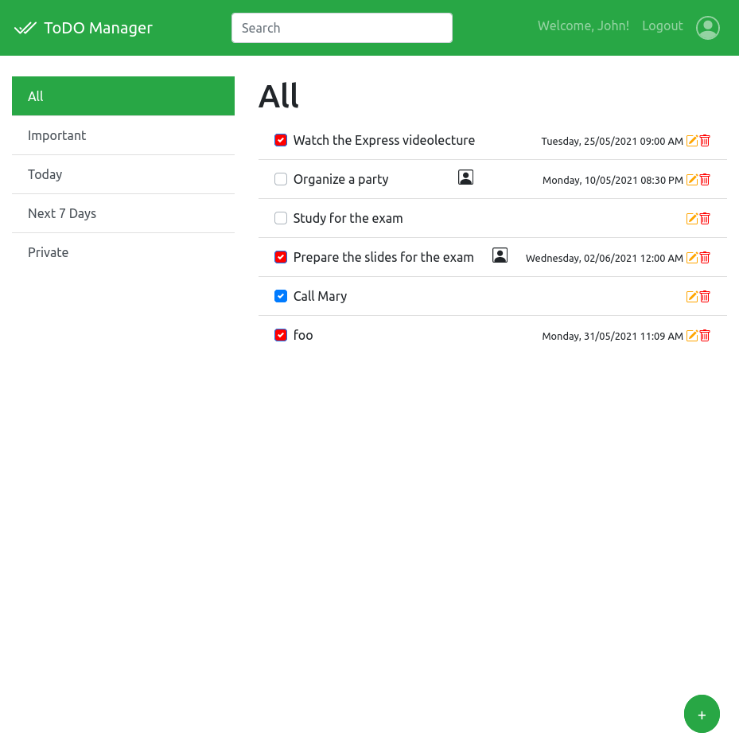

# BigLab 2 - Class: 2021 WA1

<p align="left">
 
 
 
 
 
  
 
</p>


Mirroring of the official repository hosted on github classroom.

## Team name: WAGroup63

Team members:
* s287646 Pronesti Massimiliano
* s287802 Tekam Lapa Luc-Gabin
* s286584 Hobballah Yasser
* s289417 Alashram Amr

## Instructions

A general description of the BigLab 2 is avaible in the `course-materials` repository, [under _labs_](https://github.com/polito-WA1-AW1-2021/course-materials/tree/main/labs/BigLab2/BigLab2.pdf). In the same repository, you can find the [instructions for GitHub Classroom](https://github.com/polito-WA1-AW1-2021/course-materials/tree/main/labs/GH-Classroom-BigLab-Instructions.pdf), covering this and the next BigLab.

Once cloned this repository, instead, write your names in the above section.

When committing on this repository, please, do **NOT** commit the `node_modules` directory, so that it is not pushed to GitHub.
This should be already automatically excluded from the `.gitignore` file, but double-check.

When another member of the team pulls the updated project from the repository, remember to run `npm install` in the project directory to recreate all the Node.js dependencies locally, in the `node_modules` folder.

Finally, remember to add the `final` tag for the final submission, otherwise it will not be graded.

## List of APIs offered by the server

Here's a description of the REST API offered by the server 

* POST `/sessions`
  - request body: an object representing a user (Content-Type: `application/json`)

  ```json
  {
      "username": "johndoe@polito.it",
      "passowrd": "password"
  }
  ```
  - response body:  user info (Content-Type: `application/json`)
  
  ```json
  {
    "id": 1,
    "name": "John",
    "email": "john.doe@polito.it",
    "hashpasswd": "$2b$10$nHLAdGNSlomYH61JO6clH.kZeY7LPlNeuDY1yThhzoEipjJI3YYdW"
  }
  ```
  - Error responses: `401 (Unauthenticated User)`

* DELETE `/sessions/current`
  - Request body: None
  - Response body: None

* GET `/sessions/current`
  -  request body: None
  -  response body: user info (Content-Type: `application/json`)
  
  ```json
  {
    "id": 1,
    "name": "John",
    "email": "john.doe@polito.it",
    "hashpasswd": "$2b$10$nHLAdGNSlomYH61JO6clH.kZeY7LPlNeuDY1yThhzoEipjJI3YYdW"
  }
  ```
  -  Error responses: `401 (Unauthenticated User)`

* GET `/tasks/?filter`
  - Request body: None
  - Response body: an array of objects describing the tasks (Content-Type: `application/json`)

  ```json
  [{
    "id": 4,
    "description": "Watch the Express videolecture",
    "important": true,
    "priv": true,
    "deadline": "2021-05-25T07:00:00.000Z",
    "completed": true,
    "user": 1
  },
  {
    "id": 6,
    "description": "Organize a party",
    "important": false,
    "priv": false,
    "deadline": "2021-05-10T18:30:00.000Z",
    "completed": false,
    "user": 1
  },
  {
    "id": 7,
    "description": "Study for the exam",
    "important": true,
    "priv": true,
    "completed": false,
    "user": 1
  },
  {
    "id": 8,
    "description": "Prepare the slides for the exam",
    "important": true,
    "priv": false,
    "deadline": "2021-06-01T22:00:00.000Z",
    "completed": true,
    "user": 1
  },
  {
    "id": 9,
    "description": "Call Mary",
    "important": false,
    "priv": true,
    "completed": true,
    "user": 1
  }]
  ```
  - Error responses: `500 (database error)`

* POST `/tasks`
  -  Request body: an object representing a task (Content-Type: `application/json`)

  ```json
  {
      "id": 11,
      "description": "foo",
      "important": 0,
      "private": 0,
      "completed": 1,
      "user": 1
   }
  ```
  -  Response body: None
  -  Error responses: `550 (database error)`

* PUT `/tasks/:id`
  -  Request body: an object representing a task (Content-Type: `application/json`)

  ```json
  {
      "id": 11,
      "description": "foo",
      "important": 0,
      "private": 0,
      "completed": 1,
      "user": 1
   }

  ```
  -  Response body: None
  -  Error responses: `503 (PUT Error)`

* DELETE `/tasks/:id`
  -  Request body: None
  -  Response body: None
  -  Error responses: `550 (DELETE ERROR)`

## Screenshot




## Login instructions
To test the application, login with the following credentials


| Username           | Passoword |
|--------------------|-----------|
| john.doe@polito.it | password  |
| mhh@polito.it      | password  |


